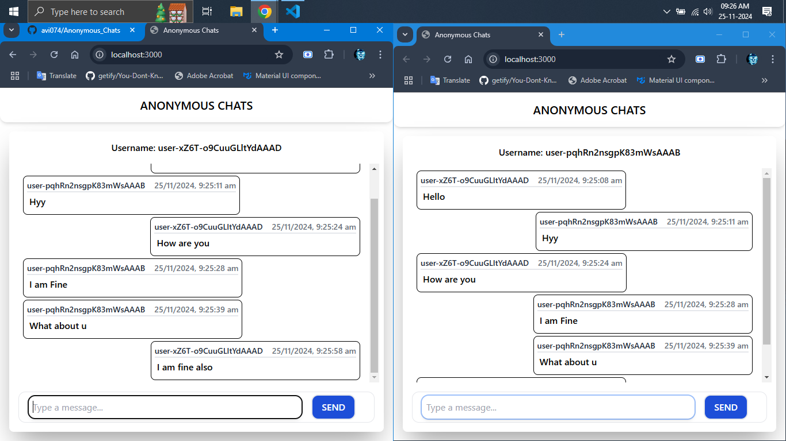

# Anonymous Chats

A simple express app to chat with random users with the help of socket.io with utmost privacy.

## Prerequisites

Before you start, ensure you have Node.js installed on your machine. If not, you can download and install it from [here](https://nodejs.org/).

## Installation

1. Clone the repository:

```bash
git clone https://github.com/avi074/Anonymous_Chats.git
```

2. Navigate into the project directory:

```bash
cd Anonymous_Chats
```

3. Install dependencies:

```bash
npm install
```

## Usage

To start the app

```bash
npm start
```

## Folder Structure

- `config` : Contains configuration files

- `model/` : Contains mongodb models

- `routes/` : Contains multiple routers based on models

- `public/` : Contains public files

- `server.js` : server file

- `socketEvents.js` : contains socket events

## Screenshot

- Communication between two browsers


## Contributing

Pull requests are welcome. For major changes, please open an issue first to discuss what you would like to change.

## Licence

[MIT](./LICENSE)